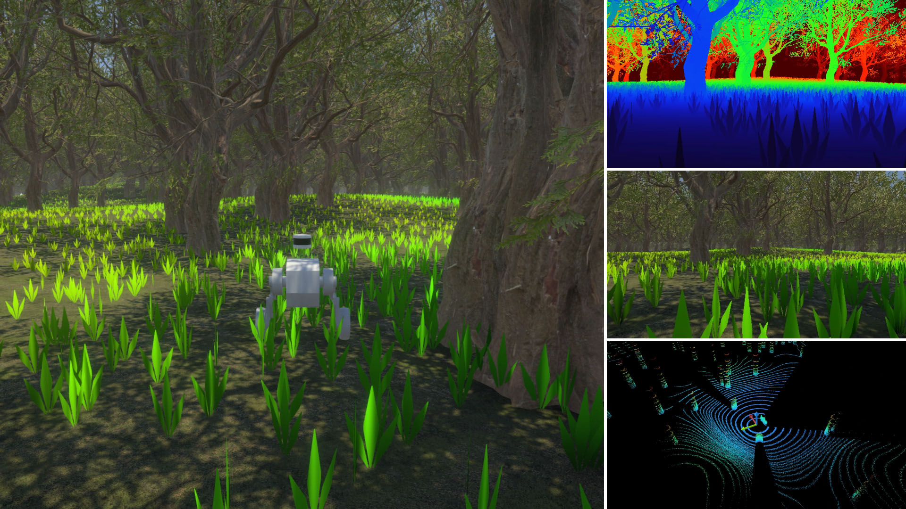
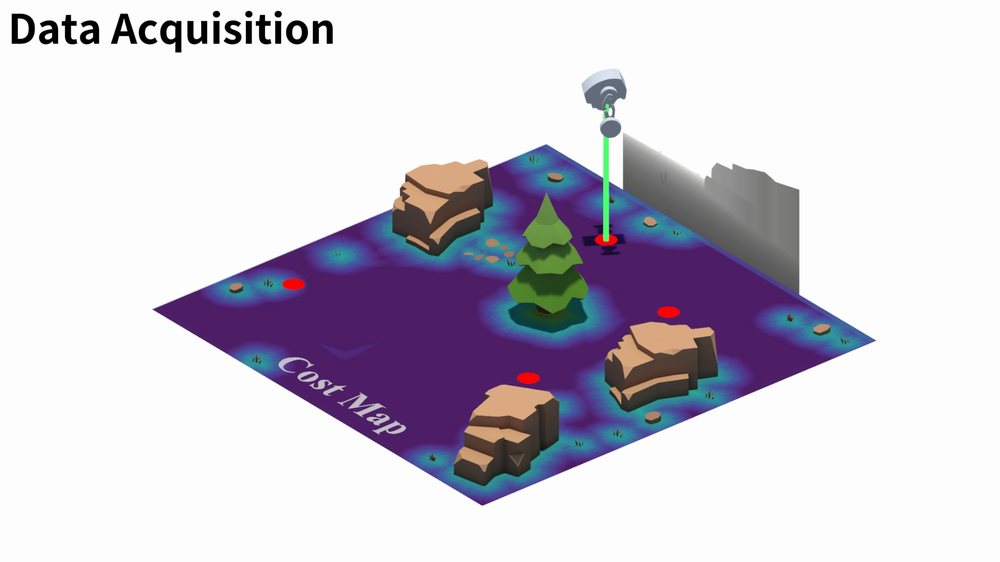

# YOPO-Rally
A Sim-to-Real Single-Stage Planner for Off-Road Terrain

> \[!NOTE]
>
> The code will be released soon.

Video: [YouTube](https://youtu.be/dyoufaKgVa0), [Bilibili](https://www.bilibili.com/video/BV1D1V7zQEWr)

## News
- **2025-7-1**: [YOPO-Sim](https://github.com/TJU-Aerial-Robotics/YOPO-Sim.git), the off-road vehicle simulator, is released.

## System Overview

## Simulator
Please refer to the [YOPO-Sim](https://github.com/TJU-Aerial-Robotics/YOPO-Sim).

## Imitation Learning

### Cost Map Generation
The terrain is exported as the point cloud map, and is then processed by TTA (Terrain Type Analysis) to generate the cost map.

<!-- Video -->
https://github.com/user-attachments/assets/9114d64a-cec4-42c8-93c3-7d9c15ee0e10

### Data Acquisition
The depth image, position, and orientation of the vehicle are recorded in the simulator.

### Trajectory Optimization
Cone constraints are applied to each primitive anchor to confine the trajectory within the neural network’s output range.

<!-- Video -->
https://github.com/user-attachments/assets/d9902d38-5c5b-4b8a-aec8-42a6decb11fb

## Inference
The planner inputs depth image, velocity, goal vector, and outputs the candidate trajectories with the corresponding cost.

<!-- Video -->
https://github.com/user-attachments/assets/a4583249-a9d8-4ef8-8d7d-87dd9a78e298

## Experiments
Please refer to the video for the experiment results.
